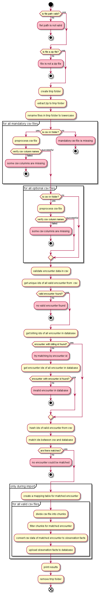

# p21-script 

A Python script to import inpatient treatment data according to §21 KHEntgG into the AKTIN DWH

The script is intended to import csv files with inpatient treatment data according to §21 KHEntG into the local i2b2 database of the AKTIN DWH. All data is uploaded into the [`observation_fact`](https://community.i2b2.org/wiki/display/ServerSideDesign/OBSERVATION_FACT+Table) table of i2b2. Following requirements must be met by the csv files:
* all csv files must be uploaded together as a zip archive
* all files must be encoded in UTF-8
* the semicolon `;` is used as a separator for data fields
* the comma `,` is used as a separator for decimals

The processes look like following:

An import is currently only possible of the four files `fall.csv`, `fab.csv`, `icd.csv` and `ops.csv`. The zip archive must contain at least the file `fall.csv`. The other csv files are optional. All other files will be
ignored by the import script.

Of the columns contained in the individual csv files, only selected ones are imported. The following table shows the importable columns. Columns that are not listed are ignored.

| CSV file | Column/§21-Variable | Mandatory variable? |
| :-------------: |:-------------| :-----:|
| fall.csv | KH-internes-Kennzeichen | yes |
| fall.csv | IK-der-Krankenkasse | |
| fall.csv | Geburtsjahr | |
| fall.csv | Geschlecht | |
| fall.csv | PLZ | |
| fall.csv | Aufnahmedatum    |  yes |
| fall.csv | Aufnahmegrund    |  yes |
| fall.csv | Aufnahmeanlass    |  yes |
| fall.csv | Fallzusammenführung    | |
| fall.csv | Fallzusammenführungsgrund    | |
| fall.csv | Verweildauer-intensiv    | |
| fall.csv | Entlassungsdatum    | |
| fall.csv | Entlassungsgrund    | |
| fall.csv | Beatmungsstunden    | |
| fall.csv | Behandlungsbeginn-vorstationär    | |
| fall.csv | Behandlungstage-vorstationär    | |
| fall.csv | Behandlungsende-nachstationär    | |
| fall.csv | Behandlungstage-nachstationär    | |
| fab.csv  | KH-internes-Kennzeichen    |  yes |
| fab.csv  | Fachabteilung    |  yes |
| fab.csv  | FAB-Aufnahmedatum    |  yes |
| fab.csv  | FAB-Entlassungsdatum    | |
| fab.csv  | Kennung-Intensivbett    |  yes |
| icd.csv  | KH-internes-Kennzeichen    |  yes |
| icd.csv  | Diagnoseart    |  yes |
| icd.csv  | ICD-Version    |  yes |
| icd.csv  | ICD-Kode    |  yes |
| icd.csv  | Lokalisation    | |
| icd.csv  | Diagnosensicherheit    | |
| icd.csv  | Sekundär-Kode    | |
| icd.csv  | Sekundär-Lokalisation    | |
| icd.csv  | Sekundär-Diagnosensicherheit    | |
| ops.csv  | KH-internes-Kennzeichen    |  yes |
| ops.csv  | OPS-Version    |  yes |
| ops.csv  | OPS-Kode    |  yes |
| ops.csv  | Lokalisation    | |
| ops.csv  | OPS-Datum    |  yes |

Only valid encounter of a csv file are imported, i.e. the necessary fields of an encounter are complete and correspond to the formatting specifications set by
the [InEK GmbH](https://www.g-drg.de/Datenlieferung_gem._21_KHEntgG). A distinction is made between mandatory and optional fields. An invalid mandatory field leads to the exclusion of the whole encounter. An invalid optional
field will be ignored during the import.

As the inpatient treatment data is only an extension of the routine documentation of the emergency departments stored in the AKTIN DWH, all valid encounters from the §21 data must be matched with existing encounters from the
routine documentation. Matching with existing encounters is done using the field `KH-internes-Kennzeichen` of the csv files and the field `billing id` (or alternatively `encounter id`) of the imported CDA documents.

## Usage

The script is only suitable for usage on the AKTIN DWH V1.4 or higher. For the installation of the script on the AKTIN DWH, following steps are necessary:

* Put the script on the server of your AKTIN DWH into the folder `/var/lib/aktin/import-script/`
* Change the owner of the script to be `wildfly:wildfly`
* Restart your AKTIN DWH
* The script should appear in the view of the AKTIN DWH in the tab `Daten-Import`.
* Select the script and import your data

### Local Usage

It is also possible to run the script manually. For this, the path to the zip file to be uploaded must be passed to the script as an input argument:

`python p21import.py {path to the zip file}`

When executing the script via the AKTIN DWH, some information is transmitted as environment variables. For local execution the following variables must be set accordingly:

| Parameter  | Description | Example |
| ------------- | ------------- | ------------- |
| script_id | ID of p21import.py (see @ID=****) | p21 |
| script_version | Version of p21import.py (see @VERSION=****) | 1.5 |
| uuid | UUID of the uploaded zip file on the AKTIN DWH | e296bf5c-46b3-11ec-81d3-0242ac130003 |
| username | User of the i2b2 database | username |
| password | Password of the database user | password |
| connection-url | Connection url to the i2b2 database | jdbc:postgresql://localhost:5432/i2b2 |
| path_aktin_properties | Path to the aktin.properties | /etc/aktin/aktin.properties |

## Testing

For testing the script, the folder `test/` is attached. The subfolders perform the following functions :

* `integration/` : All tests that require a database connection. Currently Unfinished.
* `local/` : Script with dummy configuration to run `p21import.py` locally
* `resources/` : Test data used by all tests
* `unit/` : Unit tests for `p21import.py`
